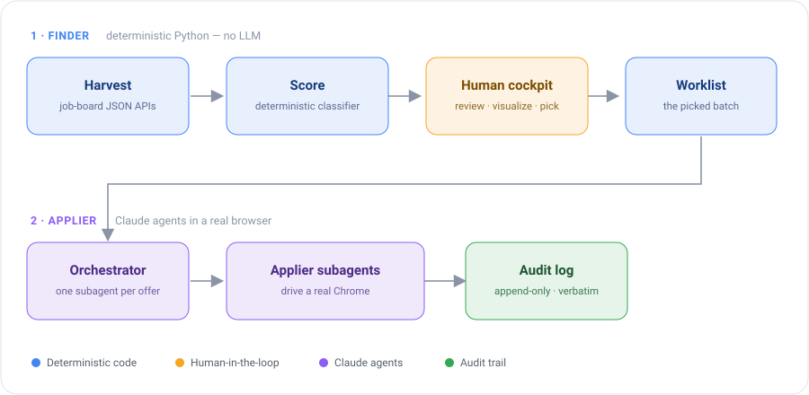

# Claude Job Searcher

**An agentic job-search platform that digs through thousands of job offers to surface the
roles that genuinely match the user's interests and growth goals — then drives the
applications itself, with a human approving every core decision.**

So far it has harvested and analyzed **10,000+ offers**, completes **~95%** of application
forms end-to-end without human correction, and prompt training cut its token cost **in half**.

<!-- TODO: demo GIF of the full flow goes here -->

---

## How it works

  <picture>
    <source media="(prefers-color-scheme: dark)" srcset="docs/pipeline-dark.svg">
    
  </picture>

A Python **finder** pulls every matching offer from the job boards' public JSON APIs into an
append-only database and scores it. A local web **cockpit** visualizes the results — grouped
by company, joined with the application history so nothing is applied to twice — and the
human picks the batch. A Claude **orchestrator** then spawns one fresh **applier subagent
per offer**; each one opens the offer in a real, logged-in Chrome, reads whatever form it
finds (internal modal, Greenhouse, Lever, Workable, a custom company site…), fills it from a
facts file, composes the free-text answers exactly to the user's established guidelines, uploads the right CV
variant, and records the outcome — verbatim — in an audit log.

---

## Why this project is interesting

### 1. A working LLM-agent architecture with real separation of concerns

The system is split into small, swappable components — microservice thinking applied to
agents:

| Component | One concrete job |
|---|---|
| **Orchestrator** | read the worklist, spawn one fresh subagent per offer, pace, verify each log line landed |
| **Applier subagents** | one offer each: detect the form type, map fields, compose answers, upload CV, log |
| **Knowledge documents** | `profile.md` holds the *facts*, the playbook holds the *behavior* — a two-brain split, so tone can change without touching facts |
| **Result documents** | append-only application log + a manual-todo file for blocked offers |

Because every component has a simple, well-scoped task, the runtime doesn't need a flagship
model — a cheaper, faster model (Claude Sonnet) handles it reliably. Fresh context per offer
also means one bad page can never poison the rest of the batch.

### 2. Code where code wins — an LLM only where reasoning is needed

The first version of the finder used an LLM to triage offers in batches, progressively
enriching them. It worked, but burned a surprising number of tokens even on cheap models —
and a language model *comparing lists* is both slower and less exact than a set lookup.

It was replaced with a **deterministic scoring pipeline**: a keyword classifier over titles,
skill tags and descriptions, plus company-level signals and statistics. Zero tokens, exact,
repeatable, auditable. The entire LLM budget is reserved for the one thing code genuinely
cannot do: reading an arbitrary, never-before-seen application form and composing honest
answers to its questions.

> Deterministic work belongs in code; only reasoning belongs in an agent's context.

### 3. Measured engineering and prompt training

Prompts are treated like code: versioned, tested, and optimized in a dedicated **trainer
loop** that runs the applier playbook against test offers and iterates on it. Measured
results so far:

- **~2× reduction in token usage** per application,
- **~95% of forms filled correctly end-to-end**, from opening the offer to the final review,
- behavior and context tuned to the actual failure modes seen in the logs, not to guesses.

The same evidence-first habit runs through the whole build: every browser-input method was
**measured at the DOM-event level** (which ones produce input indistinguishable from a human
at the event layer, which fire synthetic events) before choosing the interaction strategy,
and a subtle platform discrepancy in file uploads (same tool name, different implementations
across two Claude runtimes) was found by experiment and worked around.

### 4. Security and isolation by design — the mount boundary

The applier agent is mounted on **exactly one folder** and physically cannot see anything
above it. Everything it has no business touching — the offer database, the design docs, the
finder's code — is simply *unreachable*, not "forbidden in the prompt."

This turns prose rules into geometry: prompts got significantly shorter and cheaper, and a
whole class of "the agent wandered somewhere it shouldn't" failures became impossible by
construction. What remains in prose is only what a binary boundary cannot express.

### 5. A human in the loop, by design

- **Review mode by default**: the agent fills everything and stops — a human clicks Submit.
  Every result is human-verified, which is also how the workflow's output was tuned to match
  expectations before any autonomy is extended.
- **Facts are never invented.** Experience, salary, work authorization, certifications and
  dates come only from `profile.md`; a required field with no known answer is a *block*
  routed to a manual-todo file — never a guess.
- **Everything is auditable**: every composed answer is logged verbatim, so the user can see
  exactly what went out in their name.
- **CAPTCHAs are handed to the human.** The tool does not attempt to defeat anti-bot
  systems; it behaves like what it is — an assistant operating the user's own browser, at a
  human pace.

---

## Tech stack

- **Python 3** — harvester, deterministic scoring, and a **FastAPI** cockpit (local web UI)
- **Claude agents** (orchestrator + per-offer subagents) — markdown playbooks as the program
- **Claude-in-Chrome (MCP)** — drives the user's real, logged-in Chrome
- **JSONL append-only logs** — crash-safe audit trail and application history

## Project layout

| Folder | What it is |
|---|---|
| `finder/` | Harvest + scoring + the review cockpit (Python). Writes the worklist. |
| `src/` | The applier runtime: playbooks, facts, CVs, logs. The agent's entire visible world. |
| `trainer/` | Self-contained prompt-optimization loop with its own isolated mount. |
| `docs/` | API notes and design records. |
| `legacy/` | The original PowerShell pipeline — frozen, kept as history. |

`src/` and `trainer/` intentionally carry their own copies of the facts and CV files — each
agent mount is an isolation boundary, and that duplication *is* the security model.

## Status & roadmap

- ✅ **Applier** — live: internal modals + external ATS (Greenhouse, Lever, Workable,
  SmartRecruiters, custom sites), review mode, full audit logging
- ✅ **Finder** — live: harvest, scoring, cockpit, applied-status tracking
- ✅ **Trainer** — live: prompt-optimization loop with measured token/quality gains
- 🔜 pracuj.pl as a second offer source (offer IDs already hash source-independently, so the
  same job collapses across boards)
- 🔜 auto-submit for the cleanest ATS paths, once the trainer's quality bar is met

## Documentation

- [`ARCHITECTURE.md`](ARCHITECTURE.md) — the full design and the measured decisions behind it
- [`finder/README.md`](finder/README.md) — running the harvest + cockpit
- [`CLAUDE.md`](CLAUDE.md) — operating guide for agent sessions at this root
